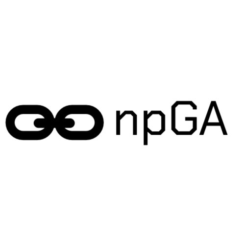
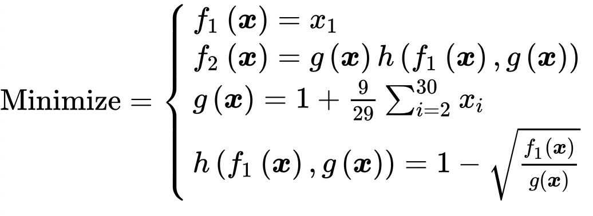
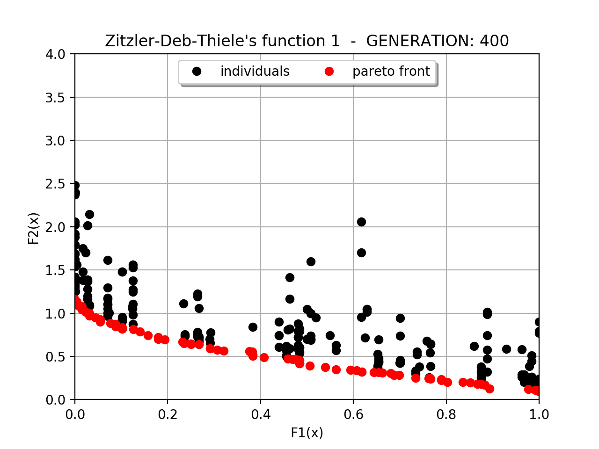
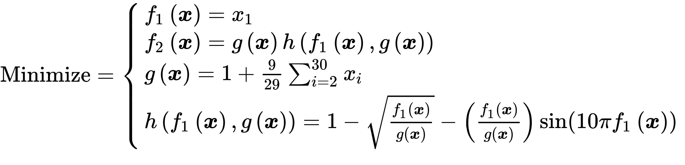
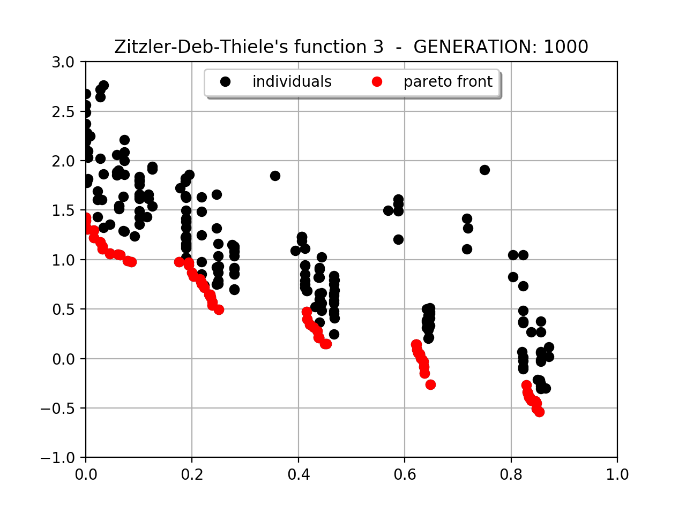

<p>
<b><font size="20">Niched Pareto Genetic Algorithm</font></b></p>

Genetic Algorithm (GA) for a  Multi-objective Optimization Problem (MOP)
<br /><br /><br />
## Introduction
To maintain multiple Pareto optimal solutions, Horn et all [1] have altered tournament selection. NPGA uses a tournament selection scheme based on Pareto dominance. Many (conventionally 2 candidates at once) individuals randomly chosen are compared against a subset from the entire population. When both competitors are either dominated or non dominated, the result of the tournament is decided through fitness sharing in the objective domain.

## Pareto Domination Tournments
The initially procedure is based on the random sampling of two groups of individuals from the entire population. *c<sub>dom</sub>* candidate chromosomes (conventionally 2 candidates at once), that are the candidates for selection as parents, are chosen at random from the population. A comparison set, of size *t<sub>dom</sub>*, of chromosomes is also chosen randomly from the population. Each of the candidate chromosomes is then compared against the chromosomes of the comparison set, and a non-inferior candidate chromosomes is selected for reproduction. If there is a tie, means neither or both of the candidate chromosomes are non-inferior, then sharing is used to decide the winner. This process continues until the number of solutions that is chosen reaches the initial size of the population. Horn and Nafpliotis [2] found that algorithm was fairly robust with respect to  *t<sub>dom</sub>*, they found significantly behaviour once *t<sub>dom</sub>* exceeded this large range of value.
- *t<sub>dom</sub>* ≈ 1% of N; result in too many dominated solutions (a very fuzzy front).  
- *t<sub>dom</sub>* ≈ 10% of N; yields a tight and complete distribution.
- *t<sub>dom</sub>* >> 20% of N; cause the algorithm to prematurely converge to a small portion of the front. Alternative tradeoffs were never even found.

##  Fitness Sharing
Goldberg and Richardson defined a sharing function [3]. They describe the idea of fitness sharing in a GA as a way of promoting stable sub-population, or species. The focus of fitness sharing is to distribute the population in search space over a number of different peaks, which are possible Pareto-optimal solutions. So, fitness sharing helps the algorithm to maintain the population diversity. Goldberg and Richardson say that when the candidates are either both dominated or both non-dominated, it is likely that they are in the same equivalance class. We are interested in maintaining diversity along the front, and most of the individuals in these equivalence classes can be labeled “equally” fit, so, the “best fit” candidate is determined to be that candidate which has the least number of individuals in its niche. If we wish to maintain useful diversity on population, it is apparent that it would be best to choose the candidate that has the smaller **niche count** *m<sub>i</sub>*. The competitor with lowest niche count won the tournament.


## Installation
When NumPy has been installed, NPGA can be installed using pip as follows:
```bash
 pip3 install git+https://github.com/EmilioSchi/Niched-Pareto-Genetic-Algorithm-NPGA
```
And later it is possible to import in code with:
```python
import NPGA
```

## Methods

### NichedParetoGeneticAlgorithm
```python
NichedParetoGeneticAlgorithm(fnGetFitness, fnDisplay, optimal_fitness, chromosome_set, chromosome_length_set, population_size = 30, max_generation = 100, crossover_rate = 0.7, mutation_rate = 0.05, length_mutation_rate = 0, growth_rate = 0.5, shrink_rate = 0.5, prc_tournament_size = 0.1, candidate_size = 2, niche_radius = 1, fastmode = False, multithreadmode = False, fnMutation = None, fnCrossover = None, historyrecoverfitness = False)
```
#### Arguments
- **fnGetFitness**: The fitness function to evaluate the solution domain.
- **fnDisplay**: At the end of each generation it is possible call the dispay function to see the state of the algorithm and useful statistics.
- **optimal_fitness**: The solution that wants to be reached.
- **chromosome_set**: String. A set of characters used in chromosome.
- **chromosome_length_set**: List of sizes that the chromosome can be assumed.
- **population_size**: Integer. The number of individuals present in each generation.
- **max_generation**: Integer. A maximum number of generation.
- **crossover_rate**: Float between 0 and 1. Crossover probability says how often will be crossover performed. If there is a crossover, offspring is made from parts of parents' chromosome, otherwise, if there is no crossover, offspring is exact copy of parents. Crossover is made in hope that new chromosomes will have good parts of old chromosomes and maybe the new chromosomes will be better.
- **mutation_rate**: Mutation probability says how often will be parts of chromosome mutated. If mutation is performed, part of chromosome is changed. Mutation is made to prevent falling GA into local extreme, but it should not occur very often, because then GA will in fact change to random search.
- **length_mutation_rate**: Float between 0 and 1. Length Mutation probability says how often will be a change in size of chromosome. The lengths of both the parent chromosomes are checked and the chromosome whose length is smaller is taken as parent 1. If lengths of both the chromosomes are the same, the exchange doesn't happen. Then, two crossover points are picked randomly for the parent 1. The bits in between the two points are swapped between the parent.
- **growth_rate**: In growth mutation the chromosome is enlarged.
- **shrink_rate**: The purpose of shrink mutation is to reduce the length of the chromosome.
- **prc_tournament_size**: Float between 0 and 1. The percentage of population that will form a comparison set in tournament selection.
- **candidate_size**: The number of candidate chromosomes that can be select as parents.
- **niche_radius**: Float. Niche Radius is the distance threshold below which two individuals are considered similar enough to affect the niche count. The concept of Niche was introduced to ensure the diversity of individuals and prevent individuals converging into a narrow region of solution space, the range of niche is a spherical area. It is fixed by the user at some estimate of the minimal separation expected between the goal solutions.  
- **fastmode**: Boolean. For many data points and problems to resolve it is useful set fastmode flag to True.
- **multithreadmode**: Boolean.
- **historyrecoverfitness**: Boolean. If a solution is already seen, the algorithm take the old value without compute the objective function.
- **fnMutation**: It is possible to declare a custom Mutation function
- **fnCrossover**: It is possible to declare a custom Crossover function

## Usage

### Define Fitness calculation function
```python
 def getfitness(candidate):
 	x = decode_chromosome_function(candidate)
 	return [[F1(x), 'maximize'], [F2(x), 'minimize'], ..., [Fn(x), 'minimize']]

 def fnGetFitness(genes): return getfitness(genes)
```

### Define display function over generation

```python
 def display(statistics):
 	print(statistic)
 	...

 def fnDisplay(statistic): display(statistic)
```

### Set parameters
```python
 geneset = '01'
 genelen = [64] # or genelen = [10, 12, 15] if there are more choromosome lengths
 optimalFitness = [0, 0]
 GA = NPGA.NichedParetoGeneticAlgorithm(
 	fnGetFitness, fnDisplay, optimalFitness,
 	geneset, genelen, population_size = 20,
 	max_generation = 30, crossover_rate = 0.7,
 	mutation_rate = 0.05, niche_radius = 0.2,
 	candidate_size = 2, prc_tournament_size = 0.2)
```
### Run
```python
paretopoints = GA.Evolution()
```

## Example
### ZDT1.py
<center>


</center>

### ZDT3.py
<center>


</center>

## Reference

<a href="http://citeseerx.ist.psu.edu/viewdoc/download?doi=10.1.1.34.4189&rep=rep1&type=pdf"> [1] N. Nafploitis J. Horn and D. E. Goldberg.  A niched pareto genetic algorithmfor multiobjective optimization.Proceedings of the First IEEE Conference on Evolutionary Computation. Z. Michalewicz, Ed. Piscataway, NJ: IEEE Press, page82–87,1994 </a>
<br />
<a href="https://www.researchgate.net/profile/Jeffrey_Horn/publication/2763393_Multiobjective_Optimization_Using_The_Niche_Pareto_Genetic_Algorithm/links/55e80a8c08aeb6516262f355.pdf">
[2] N. Nafploitis J. Horn. Multiobjective optimization using the niched pareto genetic algorithm.IlliGAL Report No.93005. Illinois Genetic Algorithm Laboratory.University of Illinois at Urbana-Champaign, 1993. </a>
<br />
<a href="https://books.google.it/books?hl=it&lr=&id=MYJ_AAAAQBAJ&oi=fnd&pg=PA41&dq=J.Richardson+D.E.Goldberg.+Genetic+algorithms+with+sharing+for+multimodalfunction+optimization.&ots=XwtKtk8ACz&sig=UcfIiupu2_Z11Op2hxg9juAE7zo#v=onepage&q&f=false">
[3] J.Richardson D.E.Goldberg.   Genetic algorithms with sharing for multimodalfunction  optimization.In:  Proceedings  of  the  second  international  conference  ongenetic algorithms, Lawrence Erlbaum Associates, Hillsdale, NJ, pages41–49,1987.</a>
