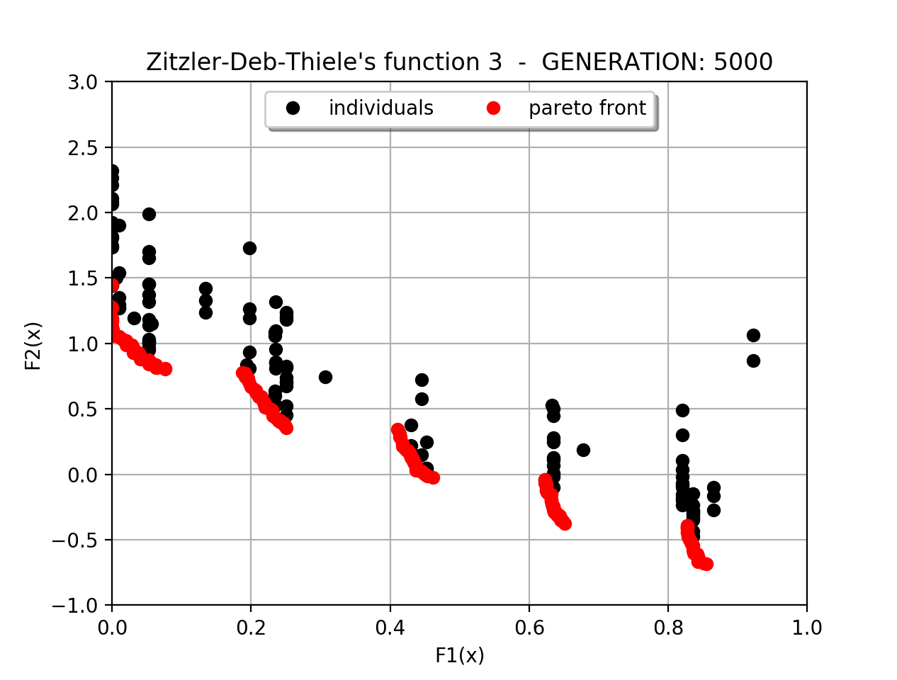

<p align="center">
  
  <br>
  Niched Pareto Genetic Algorithm
  <br>
  Genetic Algorithm (GA) for a  Multi-objective Optimization Problem (MOP)

</p>

[](http://citeseerx.ist.psu.edu/viewdoc/download?doi=10.1.1.34.4189&rep=rep1&type=pdf)


## Introduction
To maintain multiple Pareto optimal solutions, Horn et all [1] have altered tournament selection. NPGA uses a tournament selection scheme based on Pareto dominance. Many (conventionally 2 candidates at once) individuals randomly chosen are compared against a subset from the entire population. When both competitors are either dominated or non dominated, the result of the tournament is decided through fitness sharing in the objective domain.

## Pareto Domination Tournments
The initially procedure is based on the random sampling of two groups of individuals from the entire population. *c<sub>dom</sub>* candidate chromosomes (conventionally 2 candidates at once), that are the candidates for selection as parents, are chosen at random from the population. A comparison set, of size *t<sub>dom</sub>*, of chromosomes is also chosen randomly from the population. Each of the candidate chromosomes is then compared against the chromosomes of the comparison set, and a non-inferior candidate chromosomes is selected for reproduction. If there is a tie, means neither or both of the candidate chromosomes are non-inferior, then sharing is used to decide the winner. This process continues until the number of solutions that is chosen reaches the initial size of the population. Horn and Nafpliotis [2] found that algorithm was fairly robust with respect to  *t<sub>dom</sub>*, they found significantly behaviour once *t<sub>dom</sub>* exceeded this large range of value.
- *t<sub>dom</sub>* ≈ 1% of N; result in too many dominated solutions (a very fuzzy front).  
- *t<sub>dom</sub>* ≈ 10% of N; yields a tight and complete distribution.
- *t<sub>dom</sub>* >> 20% of N; cause the algorithm to prematurely converge to a small portion of the front. Alternative tradeoffs were never even found.

##  Fitness Sharing
Goldberg and Richardson defined a sharing function [3]. They describe the idea of fitness sharing in a GA as a way of promoting stable sub-population, or species. The focus of fitness sharing is to distribute the population in search space over a number of different peaks, which are possible Pareto-optimal solutions. So, fitness sharing helps the algorithm to maintain the population diversity. Goldberg and Richardson say that when the candidates are either both dominated or both non-dominated, it is likely that they are in the same equivalance class. We are interested in maintaining diversity along the front, and most of the individuals in these equivalence classes can be labeled “equally” fit, so, the “best fit” candidate is determined to be that candidate which has the least number of individuals in its niche. If we wish to maintain useful diversity on population, it is apparent that it would be best to choose the candidate that has the smaller **niche count** *m<sub>i</sub>*. The competitor with lowest niche count won the tournament.


## Installation
When NumPy has been installed as:
```bash
pip install numpy
```
or if you install numpy using Conda, write the following command:
```bash
conda install numpy
```

So, npga can be installed using pip as follows:
```bash
pip install git+https://github.com/EmilioSchi/Niched-Pareto-Genetic-Algorithm-NPGA
```
And later it is possible to import in code with:
```python
import npga as ga
```

## Local Installation
You could also clone the repository and then manually install the dependencies before running the setup script:

```bash
git clone https://github.com/EmilioSchi/Niched-Pareto-Genetic-Algorithm-NPGA.git
cd Niched-Pareto-Genetic-Algorithm-NPGA
pip install -r requirements.txt  # if a requirements file exists
pip install numpy  # if no requirements file exists
python setup.py install
```

## Methods

### NichedParetoGeneticAlgorithm
```python
class Algorithm:
    def __init__(
        self,
        objective_function: Callable,
        optimal_fitness: float,
        chromosome_length_set: List[int],
        chromosome_set: str = '01',
        display_function: Optional[Callable] = None,
        population_size: int = 30,
        max_generation: int = 100,
        crossover_rate: float = 0.7,
        mutation_rate: float = 0.05,
        length_mutation_rate: float = 0,
        growth_rate: float = 0.5,
        shrink_rate: float = 0.5,
        prc_tournament_size: float = 0.1,
        candidate_size: int = 2,
        niche_radius: float = 1,
        multithread_mode: bool = False,
        history_recover_fitness: bool = False
    )
```
#### Parameters
- **objective_function** (function): The fitness function to evaluate the solution domain.
- **display_function** (function, optional): At the end of each generation, it is possible to call the display function to see the state of the algorithm and useful statistics.
- **optimal_fitness** (float): The solution that wants to be reached.
- **chromosome_set** (str, optional): A set of characters used in the chromosome. Default is '01'.
- **chromosome_length_set** (list): A list of sizes that the chromosome can be assumed.
- **population_size** (int, optional): The number of individuals present in each generation. Default is 30.
- **max_generation** (int, optional): A maximum number of generations. Default is 100.
- **crossover_rate** (float, optional): Crossover probability, a float between 0 and 1, says how often crossover will be performed. Default is 0.7.
- **mutation_rate** (float, optional): Mutation probability, a float between 0 and 1, says how often parts of the chromosome will be mutated. Default is 0.05.
- **length_mutation_rate** (float, optional): Length Mutation probability, a float between 0 and 1, says how often a change in size of chromosome will occur. Default is 0.
- **growth_rate** (float, optional): In growth mutation, the chromosome is enlarged. Default is 0.5.
- **shrink_rate** (float, optional): The purpose of shrink mutation is to reduce the length of the chromosome. Default is 0.5.
- **prc_tournament_size** (float, optional): The percentage of the population that will form a comparison set in tournament selection, a float between 0 and 1. Default is 0.1.
- **candidate_size** (int, optional): The number of candidate chromosomes that can be selected as parents. Default is 2.
- **niche_radius** (float, optional): Niche Radius is the distance threshold below which two individuals are considered similar enough to affect the niche count. Default is 1.
- **multithread_mode** (bool, optional): Default is False.
- **history_recover_fitness** (bool, optional): If a solution is already seen, the algorithm takes the old value without computing the objective function. Default is False
## Usage

### Define Fitness calculation function
```python
 def getfitness(candidate):
 	x = decode_chromosome_function(candidate)
 	return [[F1(x), 'maximize'], [F2(x), 'minimize'], ..., [Fn(x), 'minimize']]

 def fnGetFitness(genes): return getfitness(genes)
```

### Define display function over generation

```python
 def display(statistics):
 	print(statistic)
 	...

 def fnDisplay(statistic): display(statistic)
```

### Set parameters
```python
 gene_set = '01'
 gene_len = [64] # or gene_len = [10, 12, 15] if there are more choromosome lengths
 optimalFitness = [0, 0]

 algorithm = ga.Algorithm(fnGetFitness, optimalFitness, 
                gene_len,
                chromosome_set = gene_set,
                display_function = fnDisplay,
                population_size = 200,
                max_generation = 4000, crossover_rate = 0.65,
                mutation_rate = 1/170, niche_radius = 0.02,
                candidate_size = 4, prc_tournament_size = 0.13,
                multithread_mode = True)
```
### Run
```python
pareto_points = algorithm.run()
```

## Example
### ZDT1.py
<center>


</center>

### ZDT3.py
<center>


</center>

## Reference

<a href="http://citeseerx.ist.psu.edu/viewdoc/download?doi=10.1.1.34.4189&rep=rep1&type=pdf"> [1] N. Nafploitis J. Horn and D. E. Goldberg.  A niched pareto genetic algorithmfor multiobjective optimization.Proceedings of the First IEEE Conference on Evolutionary Computation. Z. Michalewicz, Ed. Piscataway, NJ: IEEE Press, page82–87,1994 </a>
<br />
<a href="https://www.researchgate.net/profile/Jeffrey_Horn/publication/2763393_Multiobjective_Optimization_Using_The_Niche_Pareto_Genetic_Algorithm/links/55e80a8c08aeb6516262f355.pdf">
[2] N. Nafploitis J. Horn. Multiobjective optimization using the niched pareto genetic algorithm.IlliGAL Report No.93005. Illinois Genetic Algorithm Laboratory.University of Illinois at Urbana-Champaign, 1993. </a>
<br />
<a href="https://books.google.it/books?hl=it&lr=&id=MYJ_AAAAQBAJ&oi=fnd&pg=PA41&dq=J.Richardson+D.E.Goldberg.+Genetic+algorithms+with+sharing+for+multimodalfunction+optimization.&ots=XwtKtk8ACz&sig=UcfIiupu2_Z11Op2hxg9juAE7zo#v=onepage&q&f=false">
[3] J.Richardson D.E.Goldberg.   Genetic algorithms with sharing for multimodalfunction  optimization.In:  Proceedings  of  the  second  international  conference  ongenetic algorithms, Lawrence Erlbaum Associates, Hillsdale, NJ, pages41–49,1987.</a>
